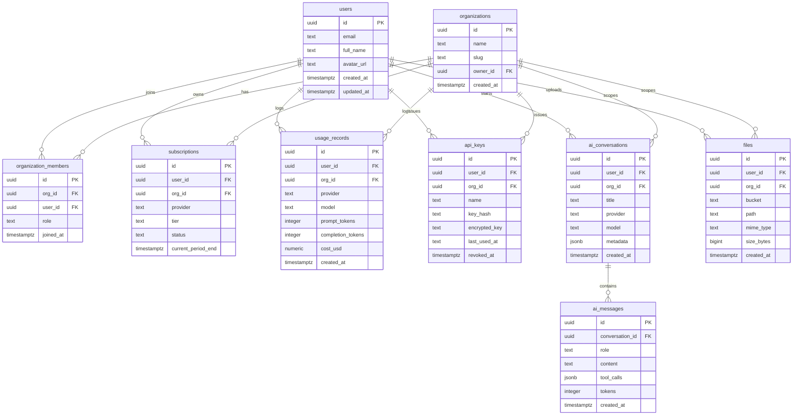

# Database Schema

> **Purpose.** This document is the authoritative reference for the Supa AI PostgreSQL schema hosted on Supabase. It lists every table, its columns, types, constraints, indexes, and Row-Level Security (RLS) policies. It also documents the three Storage buckets. The schema lives in [`supabase/migrations/`](supabase/migrations/) and is applied via `supabase db push` (or the Supabase dashboard SQL editor).

> **Status.** Phase 1. The migration file `supabase/migrations/0001_init.sql` is being authored in parallel (Task 2-b). The schema below is the **intended contract** per the orchestrator's spec; column types and policy text are normative — SQL syntax may differ slightly when the migration lands.

---

## 1. Overview

Supa AI uses a single Supabase Postgres database. All tables live in the `public` schema. Every table has:

- A `uuid` primary key (except where noted) defaulting to `gen_random_uuid()`.
- `created_at` and `updated_at` `timestamptz` columns, with `updated_at` maintained by a trigger.
- **RLS enabled.** Default-deny; access is granted by explicit policies keyed on `auth.uid()`.

### ER diagram



---

## 2. Tables

### 2.1 `users`

Profile + auth metadata for every Supa AI user. The authoritative auth record is Supabase Auth (`auth.users`); this table is the **public-facing profile row** keyed by the same `id`.

| Column | Type | Constraints | Notes |
|---|---|---|---|
| `id` | `uuid` PK | `default gen_random_uuid()` | Matches `auth.users.id`. |
| `email` | `text` | `not null`, `unique` | Denormalized for query convenience; source of truth is `auth.users.email`. |
| `full_name` | `text` | nullable | Display name. |
| `avatar_url` | `text` | nullable | Path or URL of avatar (storage bucket: `avatars`). |
| `metadata` | `jsonb` | `default '{}'::jsonb` | Free-form preferences. |
| `created_at` | `timestamptz` | `not null default now()` | |
| `updated_at` | `timestamptz` | `not null default now()` | Updated by trigger. |

**Indexes:** `users_email_idx` (unique, on `email`).

**RLS policies:**
- `users_select_self` — `using (auth.uid() = id)` — users read their own row.
- `users_update_self` — `using (auth.uid() = id) with check (auth.uid() = id)` — users update their own row.
- Insert / delete: denied from the client (rows are created by a Supabase Auth trigger).

---

### 2.2 `organizations`

A workspace that owns a set of members, conversations, files, and (optionally) a subscription.

| Column | Type | Constraints | Notes |
|---|---|---|---|
| `id` | `uuid` PK | `default gen_random_uuid()` | |
| `name` | `text` | `not null` | Display name. |
| `slug` | `text` | `not null unique` | URL-safe identifier. |
| `owner_id` | `uuid` | `not null references users(id) on delete restrict` | The owning user. |
| `avatar_url` | `text` | nullable | |
| `metadata` | `jsonb` | `default '{}'::jsonb` | |
| `created_at` | `timestamptz` | `not null default now()` | |
| `updated_at` | `timestamptz` | `not null default now()` | |

**Indexes:** `organizations_slug_idx` (unique, on `slug`); `organizations_owner_id_idx` on `owner_id`.

**RLS policies:**
- `organizations_select_member` — `using (exists (select 1 from organization_members m where m.org_id = organizations.id and m.user_id = auth.uid()))` — members can read.
- `organizations_update_owner` — `using (owner_id = auth.uid()) with check (owner_id = auth.uid())` — only owner can update.
- `organizations_delete_owner` — `using (owner_id = auth.uid())` — only owner can delete.
- Insert: any authenticated user may create an org (the trigger inserts them as `owner` in `organization_members`).

---

### 2.3 `organization_members`

Join table between `users` and `organizations` with a role.

| Column | Type | Constraints | Notes |
|---|---|---|---|
| `id` | `uuid` PK | `default gen_random_uuid()` | |
| `org_id` | `uuid` | `not null references organizations(id) on delete cascade` | |
| `user_id` | `uuid` | `not null references users(id) on delete cascade` | |
| `role` | `text` | `not null check (role in ('owner','admin','member'))` | |
| `joined_at` | `timestamptz` | `not null default now()` | |

**Constraints:** `organization_members_org_id_user_id_key` unique on `(org_id, user_id)`.

**Indexes:** `organization_members_org_id_idx` on `org_id`; `organization_members_user_id_idx` on `user_id`.

**RLS policies:**
- `organization_members_select_member` — `using (exists (select 1 from organization_members m where m.org_id = organization_members.org_id and m.user_id = auth.uid()))` — members of the same org can see the roster.
- `organization_members_insert_admin` — `with check (exists (select 1 from organization_members m where m.org_id = organization_members.org_id and m.user_id = auth.uid() and m.role in ('owner','admin')))` — only owner/admin can invite.
- `organization_members_update_admin` — same predicate as insert; used to change roles.
- `organization_members_delete_admin` — same predicate, plus the owner can never be deleted (enforced by trigger).

---

### 2.4 `subscriptions`

Tracks the active subscription for a user or organization. Exactly one of `user_id` / `org_id` is set per row.

| Column | Type | Constraints | Notes |
|---|---|---|---|
| `id` | `uuid` PK | `default gen_random_uuid()` | |
| `user_id` | `uuid` | `references users(id) on delete cascade` | Nullable; mutually exclusive with `org_id`. |
| `org_id` | `uuid` | `references organizations(id) on delete cascade` | Nullable; mutually exclusive with `user_id`. |
| `provider` | `text` | `not null check (provider in ('stripe','paystack','flutterwave'))` | |
| `provider_subscription_id` | `text` | `not null` | The ID at the provider (e.g., `sub_xxx` for Stripe). |
| `tier` | `text` | `not null check (tier in ('free','pro','team','enterprise'))` | |
| `status` | `text` | `not null check (status in ('active','trialing','past_due','canceled','incomplete'))` | |
| `current_period_start` | `timestamptz` | nullable | |
| `current_period_end` | `timestamptz` | nullable | |
| `cancel_at_period_end` | `boolean` | `not null default false` | |
| `metadata` | `jsonb` | `default '{}'::jsonb` | Raw provider payload (sanitized). |
| `created_at` | `timestamptz` | `not null default now()` | |
| `updated_at` | `timestamptz` | `not null default now()` | |

**Constraints:** `subscriptions_user_id_org_id_check` — `((user_id is null) <> (org_id is null))` (exactly one set). `subscriptions_provider_subscription_id_provider_key` unique on `(provider, provider_subscription_id)`.

**Indexes:** `subscriptions_user_id_idx` on `user_id`; `subscriptions_org_id_idx` on `org_id`; `subscriptions_status_idx` on `status`.

**RLS policies:**
- `subscriptions_select_owner` — `using (user_id = auth.uid() or exists (select 1 from organization_members m where m.org_id = subscriptions.org_id and m.user_id = auth.uid()))` — owner or any org member can read.
- Insert / update / delete: **denied from the client**. Subscriptions are mutated exclusively by webhook handlers running with the service-role key.

---

### 2.5 `usage_records`

Append-only log of every billable AI operation. Used for billing, quotas, and analytics.

| Column | Type | Constraints | Notes |
|---|---|---|---|
| `id` | `uuid` PK | `default gen_random_uuid()` | |
| `user_id` | `uuid` | `not null references users(id) on delete cascade` | |
| `org_id` | `uuid` | `references organizations(id) on delete cascade` | Nullable (solo users). |
| `conversation_id` | `uuid` | `references ai_conversations(id) on delete set null` | Nullable. |
| `provider` | `text` | `not null` | e.g., `openai`, `anthropic`. |
| `model` | `text` | `not null` | e.g., `gpt-4o-mini`. |
| `operation` | `text` | `not null check (operation in ('chat','chat_stream','image','embed'))` | |
| `prompt_tokens` | `integer` | `not null default 0` | |
| `completion_tokens` | `integer` | `not null default 0` | |
| `total_tokens` | `integer` | `not null default 0` | Generated: `prompt_tokens + completion_tokens`. |
| `cost_usd` | `numeric(12,6)` | `not null default 0` | Pre-computed at write time. |
| `metadata` | `jsonb` | `default '{}'::jsonb` | |
| `created_at` | `timestamptz` | `not null default now()` | Partitioning candidate (Phase 6). |

**Indexes:** `usage_records_user_id_created_at_idx` on `(user_id, created_at desc)`; `usage_records_org_id_created_at_idx` on `(org_id, created_at desc)`; `usage_records_provider_idx` on `provider`.

**RLS policies:**
- `usage_records_select_owner` — `using (user_id = auth.uid() or exists (select 1 from organization_members m where m.org_id = usage_records.org_id and m.user_id = auth.uid()))`.
- Insert / update / delete: **denied from the client**. Writes happen server-side via the service-role client (in `src/lib/ai/facade.ts`).

---

### 2.6 `api_keys`

Long-lived API keys issued by users for programmatic access. The raw key is **never** stored — only its hash plus an AES-256-GCM encrypted copy for "show once" recovery flows (planned; if not needed, drop `encrypted_key`).

| Column | Type | Constraints | Notes |
|---|---|---|---|
| `id` | `uuid` PK | `default gen_random_uuid()` | |
| `user_id` | `uuid` | `not null references users(id) on delete cascade` | |
| `org_id` | `uuid` | `references organizations(id) on delete cascade` | Nullable. |
| `name` | `text` | `not null` | Human label. |
| `key_prefix` | `text` | `not null` | First 8 chars, shown in the UI as `supa_xxxx…`. |
| `key_hash` | `text` | `not null unique` | `sha256(pepper + ":" + raw_key)` hex. |
| `encrypted_key` | `text` | nullable | AES-256-GCM ciphertext of the raw key, for "show once" recovery. |
| `scopes` | `text[]` | `not null default '{}'` | e.g., `{chat,images}`. |
| `last_used_at` | `timestamptz` | nullable | |
| `expires_at` | `timestamptz` | nullable | |
| `revoked_at` | `timestamptz` | nullable | Soft-delete; null = active. |
| `created_at` | `timestamptz` | `not null default now()` | |

**Indexes:** `api_keys_key_hash_idx` (unique); `api_keys_user_id_idx` on `user_id`; `api_keys_org_id_idx` on `org_id`.

**RLS policies:**
- `api_keys_select_owner` — `using (user_id = auth.uid() or exists (select 1 from organization_members m where m.org_id = api_keys.org_id and m.user_id = auth.uid() and m.role in ('owner','admin')))`.
- `api_keys_insert_owner` — `with check (user_id = auth.uid())`.
- `api_keys_update_owner` — `using (user_id = auth.uid()) with check (user_id = auth.uid())` — used for `last_used_at`/`revoked_at`.
- Delete: denied; use `revoked_at` for soft-delete.

> See [`SECURITY.md`](SECURITY.md) §"API key hashing" for the hashing scheme and [`PROJECT_ARCHITECTURE.md`](PROJECT_ARCHITECTURE.md) §6 for the crypto module.

---

### 2.7 `ai_conversations`

A chat thread. Scoped to a user, optionally to an organization.

| Column | Type | Constraints | Notes |
|---|---|---|---|
| `id` | `uuid` PK | `default gen_random_uuid()` | |
| `user_id` | `uuid` | `not null references users(id) on delete cascade` | |
| `org_id` | `uuid` | `references organizations(id) on delete cascade` | Nullable. |
| `title` | `text` | `not null default 'New conversation'` | |
| `provider` | `text` | `not null` | Last-used provider. |
| `model` | `text` | `not null` | Last-used model. |
| `system_prompt` | `text` | nullable | Optional override. |
| `metadata` | `jsonb` | `default '{}'::jsonb` | Tags, pinned, etc. |
| `archived_at` | `timestamptz` | nullable | Soft-archive. |
| `created_at` | `timestamptz` | `not null default now()` | |
| `updated_at` | `timestamptz` | `not null default now()` | Bumped on every new message (trigger). |

**Indexes:** `ai_conversations_user_id_updated_at_idx` on `(user_id, updated_at desc)`; `ai_conversations_org_id_idx` on `org_id`.

**RLS policies:**
- `ai_conversations_select_owner` — `using (user_id = auth.uid() or exists (select 1 from organization_members m where m.org_id = ai_conversations.org_id and m.user_id = auth.uid()))`.
- `ai_conversations_insert_owner` — `with check (user_id = auth.uid())`.
- `ai_conversations_update_owner` — `using (user_id = auth.uid()) with check (user_id = auth.uid())`.
- `ai_conversations_delete_owner` — `using (user_id = auth.uid())`.

---

### 2.8 `ai_messages`

Individual messages within a conversation. Append-only (no updates).

| Column | Type | Constraints | Notes |
|---|---|---|---|
| `id` | `uuid` PK | `default gen_random_uuid()` | |
| `conversation_id` | `uuid` | `not null references ai_conversations(id) on delete cascade` | |
| `role` | `text` | `not null check (role in ('system','user','assistant','tool'))` | |
| `content` | `text` | `not null` | Markdown / plain text. |
| `tool_calls` | `jsonb` | nullable | Provider-native tool-call payload. |
| `attachments` | `jsonb` | `default '[]'::jsonb` | Array of `{ file_id, type }`. |
| `tokens` | `integer` | `not null default 0` | Token count for this message. |
| `provider` | `text` | nullable | For assistant messages. |
| `model` | `text` | nullable | For assistant messages. |
| `metadata` | `jsonb` | `default '{}'::jsonb` | |
| `created_at` | `timestamptz` | `not null default now()` | |

**Indexes:** `ai_messages_conversation_id_created_at_idx` on `(conversation_id, created_at asc)`.

**RLS policies:**
- `ai_messages_select_owner` — `using (exists (select 1 from ai_conversations c where c.id = ai_messages.conversation_id and (c.user_id = auth.uid() or exists (select 1 from organization_members m where m.org_id = c.org_id and m.user_id = auth.uid()))))`.
- `ai_messages_insert_owner` — `with check (exists (select 1 from ai_conversations c where c.id = ai_messages.conversation_id and c.user_id = auth.uid()))`.
- Update / delete: denied — messages are immutable.

---

### 2.9 `files`

Files uploaded by users (chat attachments, profile avatars, AI-generated assets). The actual bytes live in Supabase Storage; this table is the metadata index.

| Column | Type | Constraints | Notes |
|---|---|---|---|
| `id` | `uuid` PK | `default gen_random_uuid()` | |
| `user_id` | `uuid` | `not null references users(id) on delete cascade` | |
| `org_id` | `uuid` | `references organizations(id) on delete cascade` | Nullable. |
| `bucket` | `text` | `not null check (bucket in ('avatars','uploads','ai-assets'))` | |
| `path` | `text` | `not null` | Object key within the bucket. |
| `mime_type` | `text` | `not null` | |
| `size_bytes` | `bigint` | `not null check (size_bytes > 0)` | |
| `checksum` | `text` | nullable | SHA-256 of the file contents. |
| `metadata` | `jsonb` | `default '{}'::jsonb` | Dimensions, duration, etc. |
| `created_at` | `timestamptz` | `not null default now()` | |

**Constraints:** `files_bucket_path_key` unique on `(bucket, path)`.

**Indexes:** `files_user_id_created_at_idx` on `(user_id, created_at desc)`; `files_org_id_idx` on `org_id`; `files_bucket_path_idx` (unique) on `(bucket, path)`.

**RLS policies:**
- `files_select_owner` — `using (user_id = auth.uid() or exists (select 1 from organization_members m where m.org_id = files.org_id and m.user_id = auth.uid()))`.
- `files_insert_owner` — `with check (user_id = auth.uid())`.
- `files_delete_owner` — `using (user_id = auth.uid())`.
- Update: denied — file metadata is immutable after upload.

---

## 3. Storage buckets

| Bucket | Visibility | Allowed MIME types | Max size | Used for |
|---|---|---|---|---|
| `avatars` | Public read | `image/png`, `image/jpeg`, `image/webp`, `image/gif` | 2 MB | User + organization profile pictures. |
| `uploads` | Private (signed URLs only) | `application/pdf`, `text/plain`, `text/markdown`, `image/*`, `application/vnd.openxmlformats-*` | 25 MB | User-uploaded attachments for chat / document AI. |
| `ai-assets` | Private (signed URLs only) | `image/png`, `image/jpeg`, `image/webp` | 50 MB | AI-generated images and visual artifacts. |

### Bucket RLS policies (intended)

For each bucket, a policy of the form:

```sql
-- avatars: public read
create policy "avatars_public_read" on storage.objects
  for select using (bucket_id = 'avatars');

-- avatars: authenticated write to own folder
create policy "avatars_insert_own" on storage.objects
  for insert with check (
    bucket_id = 'avatars'
    and (storage.foldername(name))[1] = auth.uid()::text
  );

-- uploads + ai-assets: owner-only read + write, scoped by path prefix
create policy "uploads_select_own" on storage.objects
  for select using (
    bucket_id = 'uploads'
    and (storage.foldername(name))[1] = auth.uid()::text
  );

create policy "uploads_insert_own" on storage.objects
  for insert with check (
    bucket_id = 'uploads'
    and (storage.foldername(name))[1] = auth.uid()::text
  );

create policy "uploads_delete_own" on storage.objects
  for delete using (
    bucket_id = 'uploads'
    and (storage.foldername(name))[1] = auth.uid()::text
  );
-- (mirrored for ai-assets)
```

The path convention is `<bucket>/<user_id>/<file_id>.<ext>`, which lets RLS scope access purely by path prefix. Organization-scoped files use `<bucket>/<org_id>/<file_id>.<ext>` and require a policy that checks `organization_members`.

---

## 4. Triggers

The following triggers are intended (Phase 1):

| Trigger | Table | Action |
|---|---|---|
| `set_updated_at` | all tables with `updated_at` | On `UPDATE`, set `updated_at = now()`. |
| `bump_conversation_updated_at` | `ai_messages` (after insert) | Set parent `ai_conversations.updated_at = now()`. |
| `prevent_owner_removal` | `organization_members` (before delete/update) | Reject if the row is the org's only `owner`. |
| `cascade_org_owner_default` | `organizations` (after insert) | Insert the `owner_id` user as an `organization_members` row with role `owner`. |
| `create_user_profile` | `auth.users` (after insert) | Insert a matching row into `public.users`. |

---

## 5. Migrations workflow

Migrations live in [`supabase/migrations/`](supabase/migrations/) and follow the convention `NNNN_description.sql` (e.g., `0001_init.sql`, `0002_add_api_key_scopes.sql`).

### Apply locally

```bash
# Using the Supabase CLI
supabase db push

# Or apply a single file via psql / dashboard SQL editor
psql "$DATABASE_URL" -f supabase/migrations/0001_init.sql
```

### Reset

```bash
supabase db reset   # drops + recreates public schema, applies all migrations
```

> **Never edit a shipped migration.** Add a new one. The migration history is append-only.

---

## 6. Cross-references

- For the API surface that reads/writes these tables, see [`API_SPECIFICATION.md`](API_SPECIFICATION.md).
- For RLS, encryption, and API-key hashing details, see [`SECURITY.md`](SECURITY.md).
- For the data-access layer (Supabase clients), see [`PROJECT_ARCHITECTURE.md`](PROJECT_ARCHITECTURE.md) §2.2.
