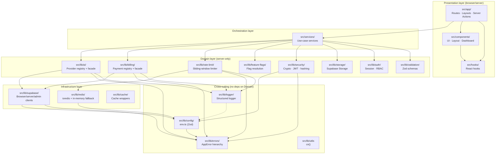

# Project Architecture

> **Purpose.** This is the flagship technical reference for Supa AI. It documents the layered architecture, the responsibility of every `src/lib/*` module, the cross-module dependency graph, and the key abstractions (AI provider registry, billing provider registry, rate-limit system, security/crypto layer, error normalization). Read this before touching `src/lib/`.

This document reflects **Phase 1 — Foundation**. Modules marked 🚧 are scaffolded/under construction by parallel agents; modules marked ✅ are committed and stable.

---

## 1. Layered architecture

Supa AI is organized as a strict layered system. **A layer may only import from layers below it, never above.** The dependency direction is one-way; cycles are forbidden and enforced by convention + ESLint boundary checks (planned).



### ASCII summary

```
┌───────────────────────────────────────────────────────────────────────┐
│  Presentation  :  src/app  ·  src/components  ·  src/hooks            │
├───────────────────────────────────────────────────────────────────────┤
│  Orchestration :  src/services  (use-case coordinators)               │
├───────────────────────────────────────────────────────────────────────┤
│  Domain        :  ai · billing · rate-limit · feature-flags           │
│                 security · storage · auth · validation                │
├───────────────────────────────────────────────────────────────────────┤
│  Infrastructure:  supabase · redis · cache                            │
├───────────────────────────────────────────────────────────────────────┤
│  Cross-cutting :  config · errors · logger · utils  (no Domain deps)  │
└───────────────────────────────────────────────────────────────────────┘
         ▲ imports flow upward only; never down from a higher layer
```

---

## 2. Module catalog (`src/lib/*`)

### 2.1 Cross-cutting (stable, dependency-free)

| Path | Status | Responsibility |
|---|---|---|
| `src/lib/config/env.ts` | ✅ | Zod-validated env contract. Single source of truth for `process.env`. Exports an immutable, namespaced `env` object (`env.app`, `env.supabase`, `env.redis`, `env.ai`, `env.payments`, `env.security`, `env.features`). Throws `ConfigurationError` at boot if validation fails. See [`src/lib/config/env.ts`](src/lib/config/env.ts). |
| `src/lib/config/index.ts` | ✅ | Barrel — re-exports `env`, `Env`, `EnvSchema`. |
| `src/lib/errors/index.ts` | ✅ | `AppError` base class with `code` (`ErrorCode` union), `statusCode`, `details`, `internal` flag, `toJSON()`. Twelve domain subclasses: `ConfigurationError`, `ValidationError`, `AuthenticationError`, `AuthorizationError`, `NotFoundError`, `ConflictError`, `RateLimitError`, `PaymentError`, `AIProviderError`, `DatabaseError`, `StorageError`, `ExternalServiceError`. Plus `toAppError(unknown)` normalizer that wraps unknown thrown values as `INTERNAL_ERROR`. |
| `src/lib/logger/index.ts` | ✅ | Dependency-free structured logger. Five levels (`debug/info/warn/error/fatal`). Pretty output in dev, single-line JSON in prod. Pluggable `LogSink` interface (future: Sentry, Datadog). `logger.child(ctx)` for request-scoped loggers via `createRequestLogger({ requestId, userId })`. Reads `NODE_ENV` directly to avoid a boot-time circular dependency with `env.ts`. |
| `src/lib/utils.ts` | ✅ | `cn()` — Tailwind class merge helper (`clsx` + `tailwind-merge`). |

### 2.2 Infrastructure (server-only)

| Path | Status | Responsibility |
|---|---|---|
| `src/lib/supabase/` | 🚧 | Three Supabase clients: **browser** (uses `@supabase/ssr` cookie auth, RLS-enforced), **server** (Server Components / Route Handlers / Server Actions, RLS-enforced, reads session from cookies), and **admin** (service-role key, **bypasses RLS** — only for trusted back-office tasks: webhook handlers, migrations). All three read credentials from `env.supabase`. |
| `src/lib/redis/` | 🚧 | `ioredis`-backed client with **transparent in-memory fallback** when `env.redis.enabled === false`. Same interface (`get/set/incr/expire/zadd/…`) for both backends so callers don't branch. Used by `rate-limit/` and `cache/`. |
| `src/lib/cache/` | 🚧 | Thin wrappers over `redis/` for common patterns: `cacheGetOrSet(key, ttl, fn)`, `cacheInvalidate(key)`, `cacheInvalidatePattern(pattern)`. |

### 2.3 Domain (server-only)

| Path | Status | Responsibility |
|---|---|---|
| `src/lib/auth/` | 🚧 | Session helpers (`getSession()`, `requireUser()`, `requireOrgRole(role)`), RBAC primitives (`Role = owner \| admin \| member`), org-scoping helpers (`getActiveOrgId()`). Wraps `@supabase/ssr` cookie sessions. |
| `src/lib/storage/` | 🚧 | Supabase Storage wrappers for the three buckets: `avatars`, `uploads`, `ai-assets`. Provides `uploadFile(bucket, path, file)`, `signedUrl(bucket, path, ttl)`, `deleteFile(bucket, path)`. All uploads validate MIME + size limits via `validation/`. |
| `src/lib/ai/` | 🚧 | **AI provider abstraction** (registry + facade). See §4. |
| `src/lib/billing/` | 🚧 | **Billing provider abstraction** (registry + facade). See §5. |
| `src/lib/rate-limit/` | 🚧 | Sliding-window limiter. See §7. |
| `src/lib/feature-flags/` | 🚧 | Resolves flag values from `env.features.*` with runtime overrides from Supabase (planned). `isEnabled(flag, ctx)` returns boolean; `getVariant(flag, ctx)` returns string. |
| `src/lib/security/` | 🚧 | **Crypto layer**. See §6. |
| `src/lib/validation/` | 🚧 | Shared Zod schemas (`EmailSchema`, `PasswordSchema`, `UuidSchema`, `PaginationSchema`, …) reused at every API/Server Action boundary. |
| `src/lib/middleware/` | 🚧 | Next.js middleware helpers: `withAuth`, `withRateLimit`, `withCsrf` — composable wrappers around route handlers. |
| `src/lib/constants/` | 🚧 | Domain constants: `AI_PROVIDERS`, `BILLING_PROVIDERS`, `RATE_LIMIT_PRESETS`, `SUBSCRIPTION_TIERS`, `ERROR_MESSAGES`. |

---

## 3. Dependency graph — boot order

The order in which modules must initialize is fixed by their import graph. The boot path:

```
process.env
   │
   ▼
src/lib/config/env.ts        ← validates env, throws ConfigurationError on failure
   │
   ├──> src/lib/errors       ← env.ts depends on ConfigurationError (already loaded)
   │
   ▼
src/lib/logger               ← reads NODE_ENV directly (no env.ts dep — avoids cycle)
   │
   ▼
src/lib/supabase/*           ← needs env.supabase.*
src/lib/redis/*              ← needs env.redis.* (may init in-memory fallback)
src/lib/security/*           ← needs env.security.* (encryptionKey, jwtSecret, …)
   │
   ▼
src/lib/auth/*               ← needs supabase + security
src/lib/storage/*            ← needs supabase + auth (for user-scoped paths)
src/lib/ai/*                 ← needs env.ai.* + supabase (for usage_records writes)
src/lib/billing/*            ← needs env.payments.* + supabase (for subscriptions writes)
src/lib/rate-limit/*         ← needs redis + security
   │
   ▼
src/services/*               ← composes the above into use-cases
   │
   ▼
src/app/**                   ← consumes services + UI
```

**Key invariants:**
- `config` → `errors` is the only edge in the cross-cutting layer.
- `logger` does **not** import `config` to avoid a circular dep at boot.
- Domain layers never import `src/app/**`.
- Service layer never imports UI.
- Server-only modules import `"server-only"` to prevent bundling into client chunks.

---

## 4. AI provider abstraction (Registry + Facade)

### Why abstract?

Seven AI providers ship in Phase 1 (OpenAI, Anthropic, Google, OpenRouter, DeepSeek, Qwen, Grok). Each has its own SDK, auth scheme, model naming, and streaming protocol. Hard-coding any one of them into business logic would lock the product in. Supa AI isolates this behind two patterns:

1. **Registry** — a map of `providerId → ProviderAdapter`.
2. **Facade** — a single `aiChat()` / `aiChatStream()` entry point that resolves the provider, normalizes the request, normalizes the response, and converts provider errors to `AIProviderError`.

### Intended file layout

```
src/lib/ai/
├── registry.ts          # ProviderRegistry: register(providerId, adapter)
├── facade.ts            # aiChat(), aiChatStream() — the public API
├── types.ts             # ChatRequest, ChatResponse, ChatChunk, ProviderAdapter, ProviderId
├── providers/
│   ├── openai.ts        # implements ProviderAdapter for OpenAI
│   ├── anthropic.ts
│   ├── google.ts
│   ├── openrouter.ts
│   ├── deepseek.ts
│   ├── qwen.ts
│   └── grok.ts
└── index.ts             # barrel + auto-registration
```

### Type contract (planned)

```ts
// src/lib/ai/types.ts
export type ProviderId =
  | "openai" | "anthropic" | "google" | "openrouter"
  | "deepseek" | "qwen" | "grok";

export interface ChatRequest {
  provider: ProviderId;
  model: string;
  messages: ChatMessage[];
  temperature?: number;
  maxTokens?: number;
  stream?: boolean;
  userId: string;           // for usage_records + rate-limit scoping
  conversationId?: string;  // for persistence
}

export interface ChatResponse {
  content: string;
  provider: ProviderId;
  model: string;
  usage: { promptTokens: number; completionTokens: number; totalTokens: number };
  finishReason: "stop" | "length" | "tool_call";
}

export interface ProviderAdapter {
  id: ProviderId;
  chat(req: ChatRequest): Promise<ChatResponse>;
  chatStream(req: ChatRequest): AsyncIterable<ChatChunk>;
  listModels(): Promise<ModelInfo[]>;
}
```

### Facade contract (planned)

```ts
// src/lib/ai/facade.ts
export async function aiChat(req: ChatRequest): Promise<ChatResponse> {
  // 1. Resolve provider from registry (throws ValidationError if unknown).
  // 2. Apply rate-limit (per-user, per-provider).
  // 3. Call adapter.chat().
  // 4. On provider error → wrap in AIProviderError(internal: false).
  // 5. Write usage_records row (tokens, cost) — fire-and-forget.
  // 6. Return normalized response.
}

export async function* aiChatStream(req: ChatRequest): AsyncIterable<ChatChunk> {
  // 1–2. Same as above.
  // 3. for await (chunk of adapter.chatStream(req)) yield normalized chunk.
  // 4. Aggregate usage from final chunk; persist usage_records.
}
```

See [`API_SPECIFICATION.md`](API_SPECIFICATION.md) §"AI endpoints" for the HTTP surface.

---

## 5. Billing provider abstraction

Three payment providers (Stripe, Paystack, Flutterwave) for global coverage. Each supports checkout, subscription management, and webhook events, but with different schemas. The abstraction normalizes them.

### Intended file layout

```
src/lib/billing/
├── registry.ts
├── facade.ts             # createCheckoutSession(), createSubscription(), handleWebhook()
├── types.ts              # BillingProvider, CheckoutRequest, Subscription, WebhookEvent
├── providers/
│   ├── stripe.ts
│   ├── paystack.ts
│   └── flutterwave.ts
└── index.ts
```

### Type contract (planned)

```ts
export type BillingProviderId = "stripe" | "paystack" | "flutterwave";

export interface CheckoutRequest {
  provider: BillingProviderId;
  userId: string;
  orgId?: string;
  priceId: string;          // maps to provider's price/plan code
  successUrl: string;
  cancelUrl: string;
  metadata?: Record<string, string>;
}

export interface CheckoutSession {
  provider: BillingProviderId;
  sessionId: string;
  url: string;
}

export interface BillingAdapter {
  id: BillingProviderId;
  createCheckoutSession(req: CheckoutRequest): Promise<CheckoutSession>;
  constructWebhookEvent(rawBody: string, signature: string): WebhookEvent;
  cancelSubscription(subscriptionId: string): Promise<void>;
}
```

Webhook handlers normalize events to a canonical set: `checkout.completed`, `subscription.active`, `subscription.canceled`, `subscription.updated`, `payment.failed`. See [`SECURITY.md`](SECURITY.md) §"Webhook signature verification" and [`API_SPECIFICATION.md`](API_SPECIFICATION.md) §"Billing endpoints".

---

## 6. Security / crypto layer

`src/lib/security/` provides the cryptographic primitives used across the platform.

### Intended modules

| File | Responsibility |
|---|---|
| `crypto.ts` | AES-256-GCM field-level encryption: `encryptField(plaintext) → { iv, ciphertext, tag }`, `decryptField({ iv, ciphertext, tag }) → plaintext`. Key from `env.security.encryptionKey` (32-byte hex). Used to encrypt PII at rest (e.g., `api_keys.encrypted_key`). |
| `hash.ts` | API key hashing: `hashApiKey(key)` returns `sha256(pepper + ":" + key)` where `pepper = env.security.rateLimitSecret`. The full key is **never** stored; only the hash is queryable. |
| `jwt.ts` | JWT sign/verify using `jsonwebtoken` (or Web Crypto). Signs short-lived service tokens (e.g., for inter-API calls) with `env.security.jwtSecret`. (User sessions remain Supabase-issued JWTs.) |
| `index.ts` | Barrel + `assertServerOnly()` helper that re-exports `"server-only"`. |

See [`SECURITY.md`](SECURITY.md) for the full threat model.

---

## 7. Rate-limit system

Sliding-window rate limiter built on `src/lib/redis/` (with in-memory fallback for dev). Each request is bucketed by `(userId?, ip)` and a key per preset.

### Presets (planned, `src/lib/constants/`)

| Preset | Limit | Window | Scope |
|---|---|---|---|
| `auth` | 10 | 60s | per-IP |
| `ai.chat` | 20 | 60s | per-user |
| `ai.chat.stream` | 10 | 60s | per-user |
| `billing.checkout` | 10 | 60s | per-user |
| `upload` | 30 | 60s | per-user |
| `global` | 300 | 60s | per-IP |

### Headers

Every rate-limited response carries:
- `X-RateLimit-Limit`
- `X-RateLimit-Remaining`
- `X-RateLimit-Reset` (epoch seconds)
- `Retry-After` (seconds, on `429` only)

### In-memory fallback philosophy

When `env.redis.enabled === false` (typical for local dev and CI), the same `RateLimiter` interface runs against an in-memory `Map`. This:
- **Eliminates a hard dev dependency** (no Redis install required to run the app).
- Keeps rate-limit code paths exercised in tests.
- Is **never** used in production — the deployment matrix refuses to start without a Redis URL when `env.app.isProd`.

The same pattern applies to `cache/` and any future queue abstraction.

---

## 8. Error normalization strategy

Every error that crosses a layer boundary is normalized to an `AppError` (see [`src/lib/errors/index.ts`](src/lib/errors/index.ts)). The strategy:

1. **Throw domain errors, not raw `Error`.** Domain code throws `AppError` subclasses (`ValidationError`, `AIProviderError`, …).
2. **`toAppError(unknown)` is the safety net.** Route handlers, Server Actions, and `withAuth`/`withRateLimit` middleware wrap the entire call in a `try/catch` that calls `toAppError(err)`. Unknown values become `INTERNAL_ERROR` so a stray `throw "boom"` never leaks.
3. **The `internal` flag controls message exposure.** When `internal === true`, the API layer replaces `message` with a generic `"An internal error occurred."` before responding; the original message survives only in the structured log.
4. **Every error carries a stable `code`.** Clients switch on `code`, never on HTTP status alone, because some codes (e.g., `AI_PROVIDER_ERROR`) can map to multiple statuses depending on context.
5. **`RateLimitError` carries `retryAfter`** that the API layer writes to the `Retry-After` header.

### Normalization flow

```
AI provider throws SDK error
        │
        ▼
src/lib/ai/providers/openai.ts wraps it:
    throw new AIProviderError("OpenAI returned 429", { provider: "openai", status: 429 })
        │
        ▼
src/lib/ai/facade.ts catches → wraps in toAppError(err) → re-throws as AppError
        │
        ▼
src/app/api/ai/chat/route.ts catches AppError → builds ApiResponse envelope
        │
        ├──> if (err.internal) respond with generic message + log full detail
        └──> else              respond with err.message + err.details
```

---

## 9. Why Supabase over Prisma / SQLite

| Concern | Prisma + SQLite | Supabase |
|---|---|---|
| Auth | Build it yourself (sessions, refresh, MFA, OAuth). | Built-in: email/password, magic link, OAuth (Google, GitHub, …), MFA. |
| Row-level security | Application-enforced (every query must filter by `userId`). | Database-enforced via PostgreSQL **RLS policies** — bugs in app code can't leak data. |
| File storage | Separate S3 bucket + SDK. | Integrated **Storage** with same auth/RLS. |
| Realtime | Out of scope. | Built-in **Realtime** (Postgres changes broadcast). |
| Migrations | Prisma Migrate. | `supabase db push` / SQL files in `supabase/migrations/`. |
| Edge functions | None. | Deno Edge Functions for off-Next.js workloads. |
| Production-readiness of SQLite | Single-writer; horizontal scaling is hard. | Managed Postgres cluster. |

Supabase was chosen because the platform's three highest-risk concerns — **auth, row-level security, and storage** — are all solved at the database tier rather than reinvented in application code. Prisma was removed in Task 1 (see [`worklog.md`](worklog.md) and [`CHANGELOG.md`](CHANGELOG.md)).

---

## 10. Storage layer

Three Supabase Storage buckets (defined in `supabase/migrations/0001_init.sql`, planned):

| Bucket | Visibility | Used for | Max size |
|---|---|---|---|
| `avatars` | Public read | User + org profile pictures | 2 MB |
| `uploads` | Private | User file uploads (chat attachments, docs) | 25 MB |
| `ai-assets` | Private | AI-generated images, transcripts | 50 MB |

Access is enforced by Storage RLS policies tied to `auth.uid()` (see [`DATABASE_SCHEMA.md`](DATABASE_SCHEMA.md) §"Storage buckets"). Signed URLs are issued via `src/lib/storage/signedUrl()` with a 60s default TTL.

---

## 11. Feature-flag system

Two-tier resolution:

1. **Defaults** — declared in `.env.example` (`FEATURE_CHAT_ENABLED`, `FEATURE_IMAGE_GENERATION_ENABLED`, `FEATURE_MARKETPLACE_ENABLED`, `FEATURE_BUSINESS_TOOLS_ENABLED`). Parsed by `src/lib/config/env.ts` into `env.features.*` (booleans).
2. **Runtime overrides** (planned) — read from a `feature_flags` Supabase table, scoped by `userId` / `orgId` / `percentage`. The resolver merges env defaults with DB overrides and returns the final value.

```ts
// Intended API:
import { isEnabled } from "@/lib/feature-flags";

if (await isEnabled("image_generation", { userId })) { … }
```

This lets us ship dark-launched features behind flags in Phase 1 and progressively roll them out in later phases without redeploying.

---

## 12. Cross-references

- For the public API surface, see [`API_SPECIFICATION.md`](API_SPECIFICATION.md).
- For schema details, see [`DATABASE_SCHEMA.md`](DATABASE_SCHEMA.md).
- For threat model and crypto specifics, see [`SECURITY.md`](SECURITY.md).
- For deployment of these layers to dev/staging/prod, see [`DEPLOYMENT.md`](DEPLOYMENT.md).
- For phase status of each module, see [`MASTER_ROADMAP.md`](MASTER_ROADMAP.md).
